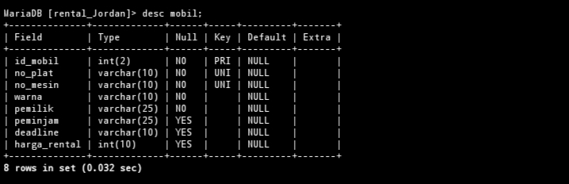

# ALTER
# Menambah kolom
## Struktur Query 
```sql
ALTER TABLE nama_kolom ADD batas_peminjaman Tipe data AFTER peminjam;
```
## Contoh Query 
```sql
ALTER TABLE mobil ADD batas_peminjaman varchart(10) AFTER peminjam;
```
### Before


### After


### Analisis
1. `ALTER TABLE mobil`: Memilih tabel yang akan dimodifikasi, yaitu tabel mobil.
2. `ADD batas_peminjaman varchar(10)`: Menambahkan kolom baru dengan nama batas_peminjaman yang memiliki tipe data varchar dengan panjang maksimum 10 karakter.
3. `AFTER peminjam`: Menentukan posisi kolom baru setelah kolom peminjam. Ini berarti kolom batas_peminjaman akan ditambahkan setelah kolom peminjam dalam struktur tabel.
### kesimpulan 
Pernyataan SQL tersebut menambahkan kolom baru dengan nama `batas_peminjam` ke tabel `mobil`dengan tipe data karakter variabel dan panjang maksimum 10 karakter, yang akan ditempatkan setelah kolom `peminjam` yang sudah ada di dalam tabel.
### Tambahan


# Mengubah nama kolom
## Struktur Query 
```sql
ALTER TABLE Nama_tabel RENAME COLUMN Nama_kolom TO deadline;
```
## Contoh Query 
```sql
ALTER TABLE mobil RENAME COLUMN batas_peminjaman TO deadline;
```
### Before


### After


### Analisis
1. `ALTER TABLE mobil`: Memilih tabel yang akan dimodifikasi, yaitu tabel mobil.
2. `RENAME COLUMN batas_peminjaman TO deadline`: Mengubah nama kolom batas_peminjaman menjadi deadline
### Kesimpulan 
Pernyataan SQL tersebut mengubah nama kolom yang sudah ada dari `batas_peminjam` menjadi `deadline` di dalam tabel `mobil`.
# Mengubah tipe data kolom
## Struktur Query 
```sql

```
## Contoh Query 
```sql
ALTER TABLE mobil MODIFY deadline DATE;
```

### Before


### After


### Analisis
1. `ALTER TABLE mobil`: Memilih tabel yang akan dimodifikasi, yaitu tabel mobil.
2. `MODIFY deadline DATE`: Mengubah tipe data kolom deadline menjadi DATE.
### Kesimpulan 
ALTER TABLE mobil MODIFY deadline DATE;` mengubah tipe data kolom "`deadline`" dalam tabel "`mobil`" menjadi DATE`. Ini memastikan bahwa kolom tersebut hanya dapat menyimpan nilai-nilai tanggal yang valid. Pastikan untuk memeriksa kompatibilitas data yang ada dan lakukan pencadangan data sebelum menjalankan perintah tersebut.
# Menambahkan constraint
## Contoh Query 
```sql
ALTER TABLE mobil
ALTER deadline SET DEFAULT ’Ready’;
```
### Before

### After


### Analisis
1. `ALTER TABLE`: Ini adalah perintah SQL yang digunakan untuk mengubah struktur tabel.
2. `mobil`: Ini adalah nama tabel yang ingin Anda ubah strukturnya.
3. `ALTER deadline SET DEFAULT READY`: Ini adalah bagian yang melakukan perubahan. Perintah ini mengatur nilai default untuk kolom "`deadline`" dalam tabel "`mobil`" menjadi `READY`. PIni berarti bahwa jika baris baru ditambahkan ke tabel tanpa nilai yang ditentukan untuk kolom "`deadline`", maka nilainya akan secara otomatis diatur menjadi '`READY`'.
### kesimpulan
Perintah `ALTER TABLE mobil ALTER deadline SET DEFAULT 'READY';` mengatur nilai default untuk kolom "`deadline`" dalam tabel "`mobil`" menjadi '`READY`'. Ini akan membuat '`READY`' menjadi nilai default untuk kolom "`deadline`" jika tidak ada nilai yang ditentukan saat penambahan baris baru. Pastikan nilai default tersebut sesuai dengan kebutuhan aplikasi Anda sebelum menjalankan perintah ini.
# Menghapus constraint 
## Struktur Query 
## Contoh Query 
```Sql
ALTER TABLE mobil
ALTER deadline DROP DEFAULT;
```
### Before

### After

### Analisis
1. `ALTER TABLE`: Ini adalah perintah SQL yang digunakan untuk mengubah struktur tabel.
2. `mobil`: Ini adalah nama tabel yang ingin Anda ubah strukturnya.
3. `ALTER deadline DROP DEFAULT`: Ini adalah bagian yang melakukan perubahan. Perintah ini menghapus nilai default dari kolom "`deadline`" dalam tabel "`mobil`". Ini berarti bahwa setelah perintah ini dijalankan, jika baris baru ditambahkan ke tabel tanpa nilai yang ditentukan untuk kolom "`deadline`", kolom tersebut tidak akan memiliki nilai default.
### kesimpulan
Perintah `ALTER TABLE mobil ALTER deadline DROP DEFAULT;` menghapus nilai default dari kolom "`deadline`" dalam tabel "`mobil`". Setelah perintah ini dijalankan, kolom tersebut tidak akan memiliki nilai `default`. Pastikan hal ini sesuai dengan kebutuhan aplikasi Anda sebelum menjalankan perintah tersebut.
# Menghapus kolom
## Contoh Query
```Sql
ALTER TABLE mobil DROP COLUMN deadline;
```
### Before

### After

### Analisis
1. `ALTER TABLE`: Ini adalah perintah SQL yang digunakan untuk mengubah struktur tabel.
2. `mobil`: Ini adalah nama tabel yang ingin Anda ubah strukturnya.
3. `DROP COLUMN deadline`: Ini adalah bagian yang melakukan perubahan. Perintah ini menghapus kolom "`deadline`" dari tabel "`mobil`". Ini berarti bahwa setelah perintah ini dijalankan, kolom "`deadline`" beserta semua data yang ada di dalamnya akan dihapus dari tabel "`mobil`".
### kesimpulan
Perintah `ALTER TABLE mobil DROP COLUMN deadline;` menghapus kolom "`deadline`" dari tabel "`mobil`". Ini akan menghapus semua data yang terkait dengan kolom tersebut. Pastikan untuk membuat pencadangan data sebelum menjalankan perintah ini dan pastikan bahwa penghapusan kolom tersebut sesuai dengan kebutuhan apk anda.

# Mengubah Nama tabel
## Contoh Query 
```sql
ALTER TABLE mobil RENAME TO data_mobil;
```
### Analisis
1. `ALTER TABLE`: Ini adalah perintah SQL yang digunakan untuk mengubah struktur tabel.
2. `mobil`: Ini adalah nama tabel yang ingin Anda ubah.
3. `RENAME TO data_mobil`: Ini adalah bagian yang melakukan perubahan. Perintah ini mengubah nama tabel "`mobil`" menjadi "`data_mobil`"..
### kesimpulan
Perintah `ALTER TABLE mobil RENAME TO data_mobil;` mengubah nama tabel "`mobil`" menjadi "`data_mobil`". Pastikan untuk memperbarui kode atau query  yang menggunakan nama tabel lama setelah menjalankan perintah ini.
### Referensi ALTER
https://www.techonthenet.com/mysql/tables/alter_table.php