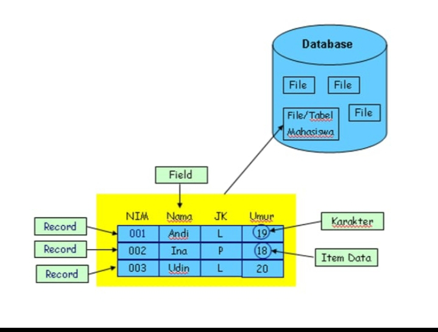
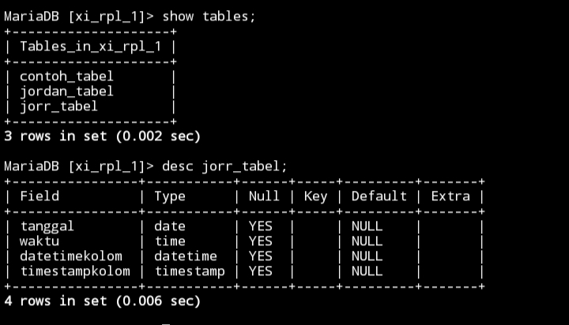
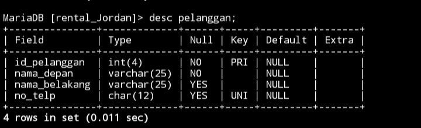
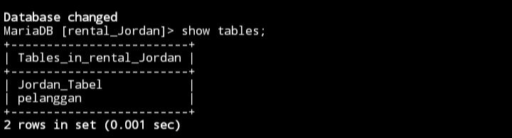
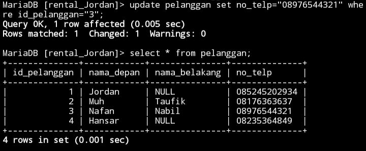
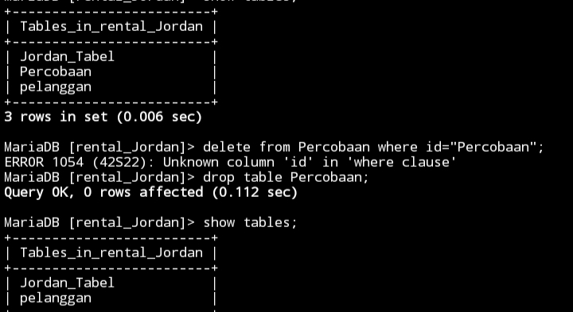

# Basis Data

kumpulan data yang terorganisir, yang umumnya disimpan dan diakses secara elektronik dari suatu sistem komputer
# Basis

adalah himpunan vektor, yang dalam sebuah kombinasi linear dapat merepresentasikan setiap vektor dalam suatu ruang vektor
# Data

catatan atas kumpulan fakta. Dalam penggunaan sehari-hari, data berarti suatu pernyataan yang diterima secara apa adanya.

# Kesimpulan
Basis Data adalah Kumpulan informasi yang tersimpan di dalam komputer secara sistematik sehingga di periksa menggunakan suatu program komputer untuk memperoleh informasi dari basis data tersebut**

# Peranan Basis Data
Peranan suatu basis data di Toko Online Membantu konsumen dalam pencarian barang secara online,dan mempermudah mengetahui data pribadi kepada pelanggan seperti nama,nomor,dan,alamat.

# Struktur Tabel dalam Data Base
Hirarki dalam database adalah struktur organisasi data dalam database yang mengatur hubungan antara entitas atau tabel data. Dalam hirarki database, data diorganisir dalam bentuk pohon dengan satu entitas induk atau tabel utama yang memiliki beberapa entitas anak atau tabel terkait.

Contoh Tabel:
 
## Definisi Karakter Di database
### Field(kolom)
Field Dikenal sebagai kolom dalam tabel dan menyimpan informasi khusus terkait entitas yang direpresentasikan oleh tabel.
### Record(baris)
Dalam basis data Record mengacu pada kumpulan data terkait yang membentuk entitas Tunggal atau subjek suatu tabel,record juga dikenal sebagai baris dalam tabel
Setiap Record mewakili satu entitas atau objek sama seperti no absen,nama,jeniskelamin,dan umur.
### Item data/karakter
Dalam konteks basis data, item data mengacu pada nilai spesifik yang disimpan dalam field atau kolom di dalam tabel. Item data juga dikenal sebagai entri atau elemen data.
Setiap field dalam sebuah tabel akan memiliki item data yang sesuai untuk setiap record atau baris. Misalnya, jika terdapat sebuah tabel pelanggan dengan field seperti "Nama", "No absen", dan "Umur", setiap item data akan mewakili nilai khusus untuk setiap field pada record tertentu. Sebagai contoh, jika ada sebuah record pelanggan dengan nama "Taufik", No absen "016", dan umur "17", maka setiap nilai ini akan menjadi item data yang tersimpan dalam field yang sesuai.
>[!faq]- Table program
| Nama   | Nis   | No absen |
| ------ | ----- | -------- |
| Jordan | 22365 | 10       |
I
# Instalasi & Query awal database
# Penginstalan mySql 
## Menggunakan Termux
1. Berikan akses termux ke memori internal
Ketik`termux-setup-storage`
2. Muncul pop-up untuk meminta izin akses ke memori internal
Klik` izinkan/allow acces`
3. Lakukan uptade dan sekaligus upgrade paket
Ketik`pkg update && upgrade -y`
4. jika ada konfirmasi untuk melanjutkan instalasi.
Silahkan` klik y dan enter`
5. instal aplikasi MariaDB
Ketik `pkg install mariadb`
6. Memberikan Akses aman ke MySQL
Ketik` mysqld_Safe`
7. Menghentikan Proses 
Ketik` CTRL+Z`
8. untuk Masuk Kedalam admin
Ketik` mysql -u root`
## Referensi video youtube
https://youtu.be/ez3nx3xH-y4?si=T4saycipqfBcqL1c
# Penggunaan awal MySQL
## Query
MySQL -u root
```
mysql -u root
mysql: Deprecated program name. It will be removed in a future release, use '/data/data/com.termux/files/usr/bin/mariadb' instead
Welcome to the MariaDB monitor.  Commands end with ; or \g.
Your MariaDB connection id is 6
Server version: 11.1.2-MariaDB MariaDB Server

Copyright (c) 2000, 2018, Oracle, MariaDB Corporation Ab and others.

Type 'help;' or '\h' for help. Type '\c' to clear the current input statement.

MariaDB [(none)]>
```
## Hasil

## Analisis & kesimpulan 
**MySql**:
Ini adalah perintah untuk mengakses shell MySQL, yaitu antarmuka command-line untuk berinteraksi dengan server MySQL.

**-u root**-:
Parameter ini menentukan pengguna (user) yang akan digunakan untuk masuk ke server MySQL. Dalam hal ini, "root" adalah nama pengguna yang diberikan, dan "root" adalah tingkat tertinggi dengan hak akses penuh.

**Kesimpulan**:
mysql -u root memberikan akses penuh ke server MySQL dengan menggunakan pengguna "root", yang memiliki hak akses maksimum. Penggunaan perintah ini perlu hati-hati untuk menghindari risiko keamanan.

## DataBase
### Membuat Database
Untuk membuat database di MySQL,Anda dapat menggunakan perintah **==CREATE DATABASE==** dengan nama database yang akan di buat contohnya: **==xi_rpl_1;==** .pastikan untuk memiliki hak akses yang sesuai,dan verifikasi pembuatan database dengan perintah **==SHOW DATABASE==**.
### HASIL PROGRAM


### Menampilkan database
Untuk menampilkan daftar database diMySQL,anda dapat menggunakan perintah SQL **==SHOW DATABASE==**. perintah ini memberikan gambaran keseluruhan Database yang tersedia di server MySQL. Pastikan pengguna yang di gunakan memiliki izin untuk melihat database dan gunakan perintah melalui antarmuka **command-line** atau alat manajemen database seperti **phpMyAdmin** 
### Hasil

### Menghapus database
Untuk menghapus sebuah database di SQL, anda dapat menggunakan perintah **==DATABASE xi_rpl_1==** (**Nama database yang akan di hapus**). Namun perlu diingat bahwa tindakan ini akan menghapus semua data yang ada di dalam database. pastikan anda memiliki backup data yang di butuhkan sebelum melanjutkan
### Hasil


### Menggunakan database
Perintah use di gunakan untuk beralih atau menggunakan sebuah database tertentu di server. Perintah ini sangat berguna ketika anda bekerja dengan beberapa Database di server MySQL dan ingin fokus pada satu database dalam sesi tertentu. Contohnya: **==use xi_rpl_1;==**


## Tipe Data
## Angka
-  ==INT:== Untuk menyimpan nilai bilangan bulat (integer). Misalnya, INT dapat digunakan untuk menyimpan angka seperti 1, 100, -10, dan sebagainya. 

 - ==DECIMAL: ==Digunakan untuk menyimpan nilai desimal presisi tinggi, cocok untuk perhitungan finansial atau keuangan.
 - 
 - ==FLOAT dan DOUBLE: ==Digunakan untuk menyimpan nilai desimal dengan presisi floating-point. DOUBLE memiliki presisi lebih tinggi dibandingkan FLOAT.
 
 - ==TINYINT, SMALLINT,== ==MEDIUMINT==, dan ==BIGINT: ==Tipe data ini menyimpan bilangan bulat dengan ukuran yang berbeda-beda.
   Contoh : 
```

CREATE TABLE contoh_tabel (
    id INT,
    harga DECIMAL(10, 2),
    jumlah_barang TINYINT
);
```
### Hasil


Dalam contoh tersebut, `id` menggunakan tipe data `INT`, `harga` menggunakan tipe data `DECIMAL `dengan presisi 10 digit dan 2 angka di belakang koma, dan `jumlah_barang` menggunakan tipe data `TINYINT.
`
## Teks

- ==CHAR(N) ==Menyimpan string karakter tetap dengan panjang N. Contoh: ==CHAR(10) ==akan menyimpan string dengan panjang tepat 10 karakter.

- ==VARCHAR(N):== Menyimpan string karakter dengan panjang variabel maksimal N. Misalnya, ==VARCHAR(255) ==dapat menyimpan string hingga 255 karakter, tetapi sebenarnya hanya menyimpan panjang yang diperlukan plus beberapa overhead.

- ==TEXT: ==Digunakan untuk menyimpan teks dengan panjang variabel, tanpa batasan panjang tertentu. Cocok untuk data teks yang panjangnya tidak terduga.

- ==ENUM: ==Memungkinkan Anda mendefinisikan set nilai yang mungkin dan membatasi kolom hanya dapat mengambil salah satu dari nilai tersebut.

- ==SET: ==Mirip dengan ENUM, namun dapat menyimpan satu atau lebih nilai dari himpunan yang telah ditentukan.

Contoh :
```
CREATE TABLE jordan_tabel (
    nama CHAR(50),
    alamat VARCHAR(100),
    catatan TEXT,
    status ENUM('Aktif', 'Non-Aktif')
);
```

## Tanggal

- ***==DATE==** :  Menyimpan nilai tanggal dengan format YYYY-MM-DD.
- **==TIME==**: Menyimpan nilai waktu dengan format HH:MM:SS.

- **==DATETIME==**: Menggabungkan nilai tanggal dan waktu dengan format YYYY-MM-DD HH:MM:SS.

- **==TIMESTAMP ==** :Sama seperti DATETIME, tetapi dengan kelebihan diatur secara otomatis saat data dimasukkan atau diubah.

```
CREATE TABLE jorr_tabel (
    tanggal DATE,
    waktu TIME,
    datetimekolom DATETIME,
    timestampkolom TIMESTAMP
);
```

### Hasil


Dalam contoh ini, kolom **==tanggal==** akan menyimpan nilai tanggal, **==waktu==** menyimpan nilai waktu, ==**datetimekolom**== menyimpan kombinasi tanggal dan waktu, dan **==timestampkolom==** akan secara otomatis diatur saat data dimasukkan atau diubah.

## Boolean
=BOOL / BOOLEAN / TINYINT(1):== Digunakan untuk menyimpan nilai boolean, yang dapat mewakili kebenaran atau kesalahan. Representasi nilai benar adalah 1, sedangkan nilai salah direpresentasikan sebagai 0. Meskipun nilai selain 0 dianggap benar, secara umum, ketiganya seringkali digunakan secara bergantian. Seringkali, ketika Anda mendeklarasikan kolom sebagai BOOL atau BOOLEAN, MySQL mengonversinya secara otomatis menjadi TINYINT(1), yang juga dapat digunakan untuk menyimpan nilai boolean dengan 0 untuk false dan 1 untuk true.

1. Menggunakan `BOOLEAN`
```sql
CREATE TABLE contohTabel (
    title VARCHAR(255),
    completed BOOLEAN
);```
Dalam contoh diatas, kita mendefinisikan kolom `completed` sebagai tipe data `BOOLEAN`. Ini merupakan cara yang sah dan umum digunakan di MySQL. Nilai yang dapat disimpan dalam kolom ini adalah `TRUE` atau `FALSE`, atau dalam representasi angka, 1 atau 0.

2. Menggunakan `BOOL`
```sql
CREATE TABLE contohTabel (
    title VARCHAR(255),
    completed BOOL
);
```
Dalam contoh ini, kita menggunakan `BOOL` sebagai tipe data untuk kolom `completed`. Perlu dicatat bahwa MySQL secara otomatis mengonversi `BOOL` menjadi `TINYINT(1)`. Oleh karena itu, pada dasarnya, ini setara dengan contoh pertama. Namun, beberapa pengembang lebih suka menggunakan `BOOLEAN` untuk kejelasan.

3. Menggunakan `TINYINT(1)`
```sql
CREATE TABLE Jordan_Tabel (
    title VARCHAR(255),
    completed TINYINT(1)
);
```
Dalam contoh ini, kita menggunakan `TINYINT(1)` sebagai tipe data untuk kolom `completed`. Ini adalah pendekatan yang valid karena MySQL mengonversi `BOOL` menjadi `TINYINT(1)` secara otomatis. Dalam hal ini, nilai yang dapat disimpan adalah 1 untuk `TRUE` dan 0 untuk `FALSE`.
# Tabel
## Buat tabel
### Struktur
```sql
CREATE TABLE [nama_table] ( 
nama_kolom1 tipe_data(ukuran) [tipe_constraint] 
nama_kolom2 tipe_data(ukuran) [tipe_constraint] 
nama_kolom3 tipe_data(ukuran) [tipe_constraint] );
```
### Contoh
```sql
CREATE TABLE Pelanggan (
id_pelanggan int(4) PRIMARY KEY NOT NULL,
nama_depan varchar(25) NOT NULL,
nama_belakang varchar(25) NOT NULL,
no_telp char(12) UNIQUE );
```
## Tampilan Struktur Tabel
**Struktur Query**
`Desc [nama_table];`
**Contoh Query:**
`desc pelanggan;`
### Hasil
 
### Analisis
`id_pelanggan (INT):``

Tipe data: Integer dengan panjang 4 digit.
Atribut: PRIMARY KEY dan NOT NULL. Ini berarti kolom ini digunakan sebagai kunci utama dan tidak boleh kosong.

`nama_depan (VARCHAR):`
Tipe data: Varchar (karakter variable) dengan panjang maksimum 25 karakter.
Atribut: NOT NULL. Ini berarti kolom ini tidak boleh kosong.

`nama_belakang (VARCHAR):`
Tipe data: Varchar (karakter variable) dengan panjang maksimum 25 karakter.
Atribut: NOT NULL. Ini berarti kolom ini tidak boleh kosong.

`no_telp (CHAR):`
Tipe data: Char (karakter tetap) dengan panjang 12 karakter.
Atribut: UNIQUE. Ini berarti setiap nomor telepon harus unik dalam tabel.
### Kesimpulan
Kode SQL tersebut menciptakan tabel "Pelanggan" dengan empat kolom: `id_pelanggan`, `nama_depan`, `nama_belakang`, dan `no_telp`. Kolom `id_pelanggan` ditetapkan sebagai kunci utama dengan batasan `NOT NULL`, memastikan setiap entri memiliki ID unik. Sementara itu, kolom `nama_depan` dan `nama_belakang` juga diset sebagai `NOT NULL`, memastikan tidak ada entri tanpa nama depan atau belakang. Kolom `no_telp` memiliki batasan `UNIQUE`, yang memungkinkan setiap nomor telepon hanya muncul sekali dalam tabel. Dengan demikian, struktur tabel ini memfasilitasi penyimpanan data pelanggan dengan kebutuhan integritas referensial yang baik, memungkinkan identifikasi dan pengelompokan pelanggan dengan jelas berdasarkan ID unik dan nomor telepon yang tidak duplikat.
## Menampilkan daftar tabel
**Struktur Query:**
`show tables;`
**Contoh Query:**
`show tables;`

## QnA
> [!QnA] Mengapa hanya kolom id_pelanggan yang menggunakan constraint **==PRIMARY KEY?==**
>Premery Key bertugas membedakan nilai yang ada pada tabel seperti NIS.
>UNIQUE bertugas untuk memastikan bahwa tidak ada nilai duplikat dalam kolom tersebut.contohnya seperti,no wa,dan alamat email.
> 
> 


>[!QnA] Mengapa pada kolom no_telp yang menggunakan tipe data char bukan Varchar?
>Karena menyimpan Karakter Tetap dengan Panjang N ,jika menggunakan Varchar hanya menyimpan panjang yang diperlukan plus beberapa overhead.
>

>[!QnA] Mengapa hanya kolom no_telp yang menggunakan constraint **==UNIQUE?==**
>karena setiap pelanggang memiliki no_telp yang unik(tidak ada yang sama)
>
>

>[!QnA] Mengapa kolom no_telp tidak memakai Constraint NOT NULL, sementara kolom lainnya menggunakan Constraint tersebut?
>Karena NOT NULL berfungsi untuk Yang harus diisi.Mungkin Karena No_hp tidak harus di isi jadi tidak di kasih NOT NULL

>[!NOTE] Perbedaan Antara PRIMARY KEY DAN UNIQUE
>`Primary key` adalah sebuah kolom atau kumpulan kolom yang digunakan untuk secara unik mengidentifikasi setiap baris dalam tabel.
 `Unique` adalah sebuah konstrain yang digunakan untuk memastikan bahwa nilai-nilai dalam suatu kolom atau kumpulan kolom adalah unik. Perbedaan utama antara unique dan primary key adalah bahwa unique dapat memungkinkan nilai NULL, sedangkan primary key tidak dapat.

# Insert
## Insert 1 data
### Struktur insert
```Sql
Insert into [nama_tabel]
Values (1,
	   "Nilai 1",
	   Null,
	   "Nilai 2"
	   )
	   ;
```
### Contoh
```sql
Insert into pelanggan
Values (1,
	   "Jordan",
	   Null,
	   "085245202934"
	   )
	   ;
```
### Analisis
`INSERT INTO pelanggan`:

Ini adalah pernyataan SQL untuk menyisipkan data ke dalam tabel "pelanggan". Pernyataan ini memberi tahu SQL bahwa kita akan menambahkan data baru ke dalam tabel "pelanggan".

`VALUES (1, "Jordan", Null, "085245202934")`:
Bagian ini menetapkan nilai-nilai yang akan dimasukkan ke dalam kolom-kolom tabel "pelanggan". Nilai 1 disisipkan ke dalam kolom pertama, "Jordan" disisipkan sebagai nilai string untuk kolom kedua, NULL (nilai kosong) ditempatkan di kolom ketiga, dan "085245202934" disisipkan ke dalam kolom keempat. Pastikan urutan dan jenis nilai sesuai dengan struktur kolom tabel.
;:

`Tanda titik koma (;)` digunakan sebagai pemisah pernyataan SQL, menandakan akhir dari pernyataan.
### Kesimpulan
pernyataan INSERT yang ditujukan untuk menyisipkan data ke dalam tabel "pelanggan". Data yang akan dimasukkan melibatkan empat nilai, yaitu 1 untuk kolom pertama, "Jordan" untuk kolom kedua sebagai nama pelanggan, NULL (nilai kosong) untuk kolom ketiga, dan "085245202934" untuk kolom keempat sebagai nomor telepon pelanggan. Keseluruhan pernyataan diakhiri dengan tanda titik koma (;), yang merupakan konvensi dalam SQL untuk menandakan akhir dari pernyataan. Untuk menggunakan pernyataan ini, pastikan nilai-nilai yang dimasukkan sesuai dengan tipe dan urutan kolom yang ada dalam tabel "pelanggan".
## Insert >1 data
### Contoh
```sql
Insert Into pelanggan values (1,"Jordan",null,"085245202934"),
(2,"Muh","Taufik","08176363637"),
(3,"Nafan","Nabil","08237277388"),
(4,"Hansar",null,"08235364849");
```


# Update
**==1.Struktur Query==**
```Mysql
UPDATE nama_tabel SET nama_kolom WHERE kondisi;
```
**==2.Contoh Query==**
```Sql
update pelanggan set no_telp="089765445321" where id_pelanggan="3";
```
**==3.Hasil==**

### Analisis
`UPDATE pelanggan:`

Ini adalah pernyataan SQL yang menunjukkan niat untuk memperbarui data dalam tabel "pelanggan". Pernyataan ini diikuti oleh nama tabel yang akan diperbarui.

`SET no_telp="089765445321"`:

Bagian ini menentukan kolom yang akan diperbarui dan nilai baru yang akan diberikan. Dalam hal ini, kolom "no_telp" akan diperbarui dengan nilai "089765445321".

`WHERE id_pelanggan="3";`:

Klausa WHERE digunakan untuk menentukan kondisi yang harus dipenuhi agar pembaruan dilakukan. Dalam hal ini, pembaruan akan terjadi hanya jika nilai kolom "id_pelanggan" sama dengan "3".
### Kesimpulan
UPDATE yang digunakan untuk memperbarui nomor telepon pelanggan dalam tabel "pelanggan". Kesimpulan dari pernyataan ini adalah bahwa nomor telepon pelanggan dengan ID pelanggan yang sama dengan 3 akan diperbarui menjadi "089765445321". Pernyataan ini memanfaatkan klausa WHERE untuk memastikan bahwa pembaruan hanya terjadi pada baris dengan kondisi yang sesuai. Penting untuk memastikan bahwa kondisi WHERE mengidentifikasi dengan tepat baris yang ingin diperbarui, dan perubahan yang dihasilkan sesuai dengan kebutuhan data dalam basis data. Pernyataan diakhiri dengan tanda titik koma (;), yang merupakan konvensi dalam SQL untuk menandakan akhir dari pernyataan.

# Delete baris data
### Struktur Query
```Sql
DELETE FROM nama_tabel WHERE kondisi;
```
### Contoh Query
```Sql
DELETE FROM pelanggan WHERE id_pelanggan="4";
```
### Hasil


### Kesimpulan 
Perintah SQL ini bertujuan untuk menghapus entri pelanggan dengan ID "4" dari basis data. Ini dapat menjadi langkah yang diperlukan jika terdapat kebutuhan untuk mengelola data pelanggan, misalnya ketika pelanggan tersebut tidak aktif atau informasi yang berkaitan perlu dihapus dari sistem
# Delete tabel
### Struktur Query
```sql
DROP TABLE nama_table;
```
### Contoh Query
```sql
DROP TABLE Percobaan;
```
### Hasil

### Analisis
`DROP TABLE Percobaan;`:
Ini adalah pernyataan SQL yang menunjukkan niat untuk menghapus tabel dari basis data. Dalam hal ini, tabel yang dihapus adalah "Percobaan". Pastikan untuk memeriksa dengan cermat karena tindakan ini permanen dan dapat mengakibatkan kehilangan data yang ada dalam tabel tersebut.
# Kesimpulan
`DROP TABLE` yang bertujuan untuk menghapus tabel bernama "Percobaan" dari basis data. Pernyataan ini mengindikasikan niat untuk menghapus seluruh struktur tabel beserta data yang terkandung di dalamnya. 