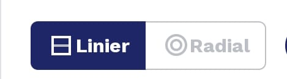
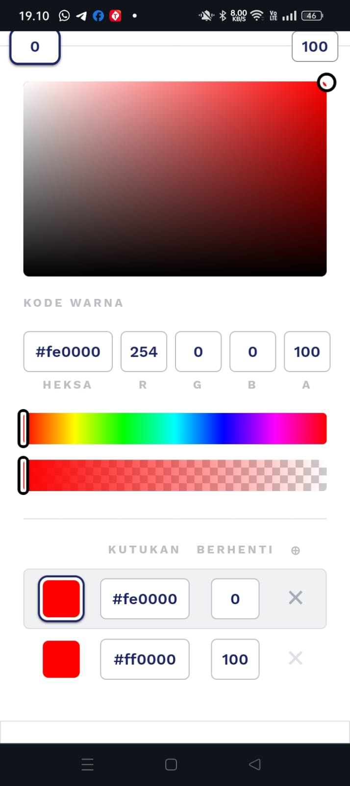
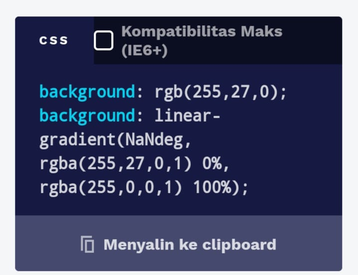
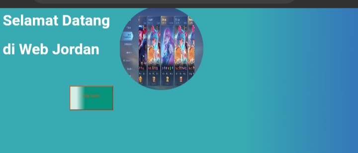

pengertian gradient
Gradient CSS adalah teknik yang digunakan untuk membuat latar belakang bergradasi atau beralih secara mulus dari satu warna ke warna lainnya. Ini memungkinkan desainer web untuk membuat efek visual menarik dan dinamis pada elemen HTML seperti latar belakang elemen, teks, atau border.

## kegunaan gradient pada web
Gradient adalah perpaduan transisi warna yang digunakan pada desain web untuk menciptakan efek visual yang menarik dan estetis. Beberapa kegunaan utama dari gradient pada web adalah:

1. Mempercantik Desain: Gradients digunakan untuk meningkatkan tampilan visual elemen-elemen seperti latar belakang, tombol, dan elemen dekoratif lainnya, sehingga membuat desain web lebih menarik dan modern.

2. Memperbaiki Keterbacaan: Dengan menggunakan gradient pada teks atau latar belakang, Anda dapat meningkatkan kontras antara teks dan latar belakangnya, sehingga meningkatkan keterbacaan konten.

3. Membuat Efek Tiga Dimensi: Gradient sering digunakan untuk menciptakan efek tiga dimensi pada elemen-elemen seperti tombol, kotak, atau gambar, yang membuat tampilan lebih hidup dan realistis.

4. Membuat Fokus: Gradients dapat digunakan untuk mengarahkan perhatian pengguna ke suatu bagian tertentu pada halaman web, misalnya, dengan menggunakan gradient yang lebih terang di area fokus.

5. Branding: Gradients dapat menjadi bagian dari identitas visual suatu merek atau situs web, sehingga membantu memperkuat citra merek dan menciptakan konsistensi visual.

6. Peningkatan Responsif: Gradients dapat disesuaikan secara responsif untuk beradaptasi dengan berbagai ukuran layar dan perangkat, sehingga tetap terlihat baik tanpa mengorbankan performa desain.

Dengan berbagai kegunaan ini, gradient telah menjadi salah satu elemen desain yang sangat populer dalam pengembangan web modern.

## jenis-jenis gradient css
Ada dua jenis utama gradient CSS: linear gradient dan radial gradient.

1. Linear Gradient:
- Linear gradient digunakan untuk membuat gradasi linier dari satu warna ke warna lainnya sepanjang sebuah garis.
-  Properti utama yang digunakan adalah background-image dengan nilai linear-gradient.
   Contoh kode CSS untuk linear gradient   ```
```css
linear-gradient(0deg, rgba(242,242,242,1) 0%, rgba(255,0,0,1) 100%);
```
Pada contoh di atas, gradient akan bergerak dari warna merah (red) ke putih (white) dari atas ke bawah.

2. Radial Gradient:
- Radial gradient digunakan untuk membuat gradasi berbentuk radial (bulat) dari satu warna ke warna lainnya.
- Properti yang digunakan mirip dengan linear gradient, menggunakan background-image dengan nilai radial-gradient.
- Contoh kode CSS untuk radial gradient
```css
radial-gradient(circle, rgba(252,0,0,1) 0%, rgba(255,255,255,1) 100%);
```
Pada contoh ini, gradient akan memiliki bentuk lingkaran (circle) dengan gradasi dari warna merah (red) ke putih(white) dari dalam ke luar.
- Selain itu, dalam CSS gradient, Anda juga dapat mengatur arah, titik awal dan akhir (pada linear gradient), dan bentuk (pada radial gradient) sesuai kebutuhan desain Anda. Gradient CSS adalah salah satu cara yang populer digunakan untuk memberikan tampilan modern dan kreatif pada halaman web.
## Penjelasan gradient manual:
Gradient manual adalah proses menciptakan gradient secara langsung dengan menentukan warna dan lokasi tertentu dari warna-warna tersebut.Anda dapat mengubah warna atau arah gradiennya dengan mengedit nilai-nilai pada properti `background` di file `styles.css`.
contoh program:
```html
<!DOCTYPE html>
<html lang="en">
<head>
<meta charset="UTF-8">
<meta name="viewport" content="width=device-width, initial-scale=1.0">
<title>Gradient Box</title>
<link rel="stylesheet" href="styles.css">
</head>
<Style>
body {
  margin: 0;
  height: 100vh;
  display: flex;
  justify-content: center;
  align-items: center;
}

.gradient-box {
  width: 200px;
  height: 200px;
  background: linear-gradient(to right, red, yellow);
  border-radius: 10px;
}
<Style>
<body>
  <div class="gradient-box"></div>
</body>
</html>
```
cara pengunaan gradient generator 
 1. tekan ling ini https://cssgradient.io/
 2. setelah masuk pilih salah satu yang ada di bawah ini jika memilih linier maka gradient akan bergerak dari atas ke bawah
    jika memilih radial maka gradient akan memiliki bentuk lingkaran 
    
3. jika sudah memilih maka atur lah warna di sini setelah sudah memilih warna maka salin lah kode program di bawak ini lalu tempel di background program anda
4. 

## Implementasi 
```html
<!DOCTYPE html>
<html>
<head>
    <title>Tantangan flexbox</title>
</head>
<style>
  body{background: rgb(55,171,177);
background: linear-gradient(90deg, rgba(55,171,177,1) 43%, rgba(52,81,192,1) 77%);

}
.main-container {
    background-color: purple;
}
.box-item-1{
    font-size: 50px;
    color: white;
    margin-top:10px;
    }
.box-item-2{
   font-size: 50px;
    color: white;
    margin-top:10px;
}

.J {
  background: rgb(213,237,231);
background: linear-gradient(90deg, rgba(213,237,231,1) 15%, rgba(6,147,124,1) 35%);
    margin-left:200px;
    padding-left:29px;
    padding-top:20px;
    padding-bottom:35px;
    padding-right:29px;
    color: orangered;
    border-color:orangered;
    margin-top: 50px; 
    margin-right:60px;
    margin-bottom:90px;
    width: 130px;
    
   
}
 
  
img{
    width: 250px;
    height: 250px;
    border-radius: 100%;
    border-color: white;
    margin-left: 350px;
    margin-top: -400px;
    position: fixed;
    
    
}
</style>
<body class="main-container">
    <div class="hero-container">
    <div class="box-container">
    <h1 class="item box-item-1">
    Selamat Datang
    </h1>
    
    <h1 class="item box-item-2">
    di <b>Web Jordan</b>
    </h1>
    <div class="item box-item-3">
    <button class="J">Klik disini</button>
    </div>
    </div>
    
    <div class="box-container">
    <div class="item-box">
    
    </div>
        </div>
    </div>
</body>
</html>
```
## Hasilnya

## Penjelasan
Program gradient di atas menggunakan properti `background` dan `linear-gradient` dalam CSS untuk membuat latar belakang dengan efek gradasi linier. Berikut adalah penjelasan komponen-komponen utama dari kode gradient tersebut:

- **background**: Properti ini digunakan untuk menetapkan warna latar belakang elemen.
- **linear-gradient**: Fungsi ini digunakan untuk membuat gradasi linier antara dua atau lebih warna.
    - `90deg`: Sudut arah gradasi, dalam hal ini mendefinisikan arah horizontal dari kiri ke kanan.
    - `rgba(55,171,177,1) 43%`: Warna pertama dalam gradasi dengan nilai RGBA (merah, hijau, biru, alpha) dan persentase letak di mana warna itu mulai muncul.
    - `rgba(52,81,192,1) 77%`: Warna kedua dalam gradasi dengan nilai RGBA dan persentase letak di mana warna itu mulai muncul.

Efek gradient linier ini memberikan tampilan latar belakang yang menarik dengan perubahan warna halus dari satu warna ke warna lainnya. Ini menciptakan tampilan visual yang menarik dan dinamis untuk halaman web.