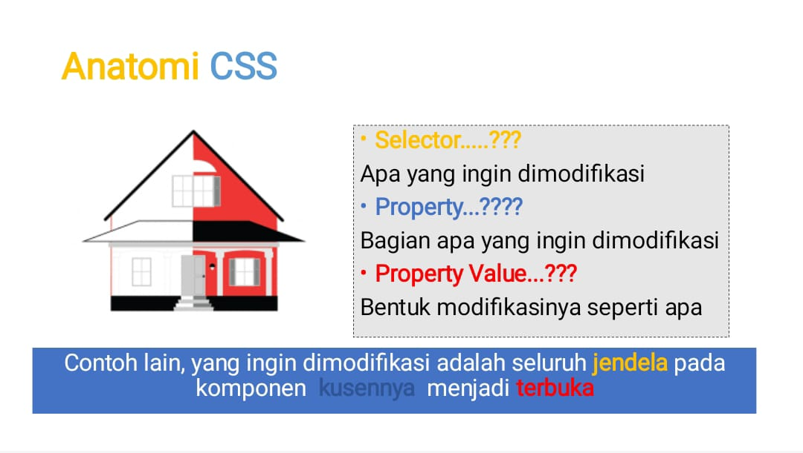

# Anatomi CSS


# Selector
Selector dalam CSS adalah mekanisme yang memungkinkan Anda memilih elemen HTML yang akan diberi gaya atau diatur tampilannya. 
# Property
Dalam CSS, properti (properties) merujuk pada atribute yang digunakan untuk mengatur penampilan dan tata letak elemen HTML. Properti didefinisikan dalam aturan gaya CSS dan memiliki nilai tertentu yang menentukan cara elemen tersebut akan ditampilkan di halaman web.
# Property value
Dalam CSS, nilai properti (property values) adalah nilai atau sekumpulan nilai yang diberikan untuk properti tertentu. Nilai properti menentukan bagaimana elemen HTML akan ditampilkan atau diatur. 
# Percobaan Pertama
### Kode Program
```Css
p {
Color: yellow
}
```
### Hasil


### Penjelasan
aturan gaya CSS yang mengatur penampilan elemen paragraf (`<p>`). 

# Percobaan ke 2
## Kode CSS
```Css
 button {
      width: 150px;
      height: 50px;
      font-size: 20px;
      border: none;
      font-weight: bold;
    }
```

## Font-size
```Css
font-size: 20px
```
### Before


### After 


### Before


### After


## Border
```css
border: none;
```
### Before


### After


## Font
```css
font-weight: bold;
```
### Before


#### after


# Cara Pemanggilan CSS
## Cara Pemanggilan Secara Eksternal
Pemanggilan CSS secara eksternal mengacu pada praktek menyisipkan aturan gaya CSS dari file terpisah ke dalam dokumen HTML. Ini dilakukan dengan menggunakan elemen `<link>` di bagian `<head>` dokumen HTML
## Contoh Kode Program
### Kode Html
```html
<!DOCTYPE html>
<html>
  <head>
    <title>belajar css</title>
    <link rel="stylesheet" href="Style.css">
  </head>
  
  <body>
   <p>ini menggunakan pemanggilan ekternal</p>
  </body>
  
</html>
```
---
### Kode CSS
```css
p {
color: yellow;
}
```
### Pemanggilan CSS Secara internal
Pemanggilan CSS secara internal merujuk pada penyisipan aturan gaya CSS langsung di dalam tag `<style>` di bagian `<head> `dokumen HTML
### Kode program
```html
<html>
  <head>
    <title>belajar css</title>
    <style>
    p {
    color : yellow;
    }
    </style>
  </head>
  
  <body>
   <p>ini menggunakan pemanggilan internal</p>
  </body>
  
</html>
```
## Pemanggilan CSS Secara inline
Pemanggilan CSS secara inline merujuk pada penyisipan aturan gaya CSS langsung di dalam atribut style pada tag HTML tertentu. 
### Kode Program
```html
<!DOCTYPE html>
<html>
  <head>
    <title>belajar css</title>
  </head>
  
  <body>
   <p style="color: yellow;">ini menggunakan pemanggilan inline</p>
  </body>
  
</html>
```
# Selector
## Selector Elemen
Selector Elemen dalam CSS digunakan untuk menargetkan dan menggaya elemen spesifik pada halaman web. Penulisan selector elemen cukup sederhana, di mana Anda menggunakan nama tag HTML sebagai selector untuk menentukan elemen yang akan diberi gaya. 
## Selector Class
Selector Class dalam CSS digunakan untuk menargetkan dan menggaya elemen-elemen yang memiliki kelas tertentu. Dengan menggunakan selector class, Anda dapat memberikan gaya kepada satu atau lebih elemen yang memiliki kelas yang sama.
## Selector Id
Selector ID dalam CSS digunakan untuk menargetkan dan menggaya elemen yang memiliki ID tertentu. ID harus unik dalam satu halaman, sehingga selector ID sangat berguna ketika Anda ingin memberikan gaya kepada elemen yang memiliki identifikasi unik

# MATERI Text
## Text Align
text-align dalam CSS adalah sebuah properti yang digunakan untuk mengatur penataan horisontal teks di dalam sebuah elemen. Properti ini dapat digunakan untuk mengatur posisi teks dalam konten elemen
Contoh:
**left**: Alirkan teks ke kiri.
**right**: Alirkan teks ke kanan.
**center**: Alirkan teks ke tengah.
**justify**: Meratakan teks ke kiri dan kanan, dengan menyesuaikan spasi antarkata untuk mengisi lebar elemen.
**justify-all**: Sama seperti justify, namun juga meratakan spasi antarkata pada baris terakhir.
### Kode Program
```html
<p style="text-align:center;">menggunakan text align center</p>
```
### Hasil


### Kesimpulan
Program tersebut menggambarkan penggunaan properti CSS text-align untuk mengatur penataan teks pada elemen paragraf (`<p>`). Pada contoh ini, text-align: center; diterapkan, sehingga teks di dalam paragraf akan berada di tengah 
## Text decoration
`text-decoration` dalam CSS adalah properti yang digunakan untuk mengatur dekorasi teks, seperti garis bawah, garis tengah, dan garis atas. Properti ini memungkinkan pengaturan visual tambahan pada teks
**==PENJELASAN==**
**Text-decoration: Underline;**
Menambahkan garis bawah pada teks.

**text-decoration: overline**;
Menambahkan garis atas pada teks.

**text-decoration: line-through**;
Menambahkan garis tengah pada teks.

**text-decoration: none;**
Menghapus semua dekorasi teks.
### Kode program
```Html
<p style="text-decoration: overline;">menggunakan text decoration underline</p>
```
### Hasil


### Kesimpulan
Program tersebut menggunakan properti CSS text-decoration pada elemen paragraf (`<p>`) dengan nilai overline untuk memberikan efek garis di atas teks.
## Text transform
**text-transform** dalam CSS adalah properti yang digunakan untuk mengontrol transformasi teks, seperti pengubahan huruf menjadi huruf kapital atau huruf kecil. Properti ini memberikan kemampuan untuk mengubah tampilan teks tanpa mengubah struktur HTML atau kontennya
**===Penjelasan===**:
**text-transform: uppercase**;
Mengubah seluruh huruf dalam teks menjadi huruf
kapital (UPPERCASE).

**text-transform: lowercase**;
Mengubah seluruh huruf dalam teks menjadi huruf kecil (lowercase).

**text-transform: capitalize**;
Mengubah huruf pertama setiap kata dalam teks menjadi huruf kapital.

**text-transform: none**;
Tidak ada transformasi teks yang diterapkan.
### Kode Program
```html
     <p style="text-transform: uppercase;">menggunakan text transform uppercase</p>
```
### Hasil

### Kesimpulan
Program tersebut menggunakan properti CSS text-transform pada elemen paragraf (`<p>`) dengan nilai uppercase untuk mengubah seluruh teks di dalamnya menjadi huruf kapital atau huruf besar.
## Text indent
**text-indent** dalam CSS adalah properti yang digunakan untuk mengatur jumlah indentasi pada awal paragraf atau baris teks. Properti ini memungkinkan penyesuaian posisi awal teks dalam suatu elemen
**text-indent**: 50px; akan membuat teks pada elemen tersebut dimulai 50 piksel dari batas kiri, menciptakan efek indentasi
### Kode program
```html
    <p style="text-indent: 50px;">menggunakan text indent 50 pixel</p>
```
### Hasil

### Kesimpulan
Program tersebut menggunakan properti CSS text-indent pada elemen paragraf (`<p>`) dengan nilai 50px. Properti ini digunakan untuk menetapkan indentasi teks pada awal paragraf sebesar 50 piksel dari batas kiri elemen.

Dengan demikian, ketika program dijalankan, teks di dalam paragraf akan dimulai dari posisi yang lebih ke kanan sejauh 50 piksel
## Letter-Spacing
**letter-spacing** dalam CSS adalah properti yang digunakan untuk mengatur jarak antara karakter dalam teks. Properti ini memungkinkan penyesuaian spasi antara huruf-huruf dalam suatu teks
**Nilai positif: Meningkatkan jarak antara karakter.**
**Nilai negatif: Mengurangi jarak antara karakter.**
### Kode Program
```html
<p style="letter-spacing: 20px;">menggunakan letter spacing 20 pixel</p>
```
### Hasil


### Kesimpulan
Program tersebut menggunakan properti CSS letter-spacing pada elemen paragraf (`<p>`) dengan nilai 20px. Properti ini mengatur jarak antar huruf dalam teks pada paragraf tersebut.
## Line-height
**line-height** adalah properti CSS yang menentukan tinggi baris di dalam sebuah elemen. Properti ini mempengaruhi jarak vertikal antara baris teks dalam elemen tersebut. Nilai **line-height** dapat didefinisikan menggunakan nilai numerik, persentase, atau nilai non-numerik seperti normal.
### Kode Program 
```html
<p style="line-height: 100px;">menggunakan line height  100 pixel</p>
```

### Kesimpulan
Program tersebut menggunakan properti CSS line-height pada elemen paragraf (`<p>`) dengan nilai 100px. Properti ini mengatur tinggi baris atau jarak vertikal antara baris teks dalam paragraf tersebut.
## Word spacing
Properti word-spacing dalam CSS digunakan untuk mengatur jarak antara kata-kata dalam teks
### Kode Program 
```html
<p style="word-spacing: 15px;">menggunakan word spacing 15 pixel</p>
```
### Hasil


### Kesimpulan
Program tersebut menggunakan properti CSS word-spacing pada elemen paragraf (`<p>|) dengan nilai 15px. Properti ini mengatur jarak antar kata dalam teks pada paragraf tersebut.

Dengan nilai word-spacing: 15px;, program menciptakan efek peningkatan jarak antar kata sebanyak 15 piksel. Sehingga, kata-kata dalam teks pada paragraf akan memiliki ruang lebih besar antar satu sama lain.
# Background
## Background-image
**background-image** adalah properti CSS yang digunakan untuk menentukan gambar latar belakang dari suatu elemen HTML
### Kode Program
```html
<!DOCTYPE html>
<html>
  <head>
    <title>belajar materi background css</title>
    <style>
    p {
      background-image: url('Video,Foto,Audio/ml2.jpg');
      height: 100vh;
    }
    </style>
  </head>
  <body>
    <p>ini background image</p>
  </body>
</html>
```
### Hasil


### Kesimpulan
Program tersebut mencoba mengatur background image pada elemen paragraf (`<p>`) dengan menggunakan CSS.
## Background-Size
**background-size** adalah properti CSS yang digunakan untuk menentukan ukuran dari gambar latar belakang yang diterapkan pada suatu elemen
### Kode Program
```html
<!DOCTYPE html>
<html>
  <head>
    <title>belajar materi background css</title>
    <style>
    p {
      background-image: url('Video,Foto,Audio/ml2.jpg');
      height: 100vh;
      background-size: 50px 50px;
    }
    </style>
  </head>
  <body>
    <p>ini background image</p>
  </body>
</html>
```
### Hasil


### Kesimpulan 
Program di atas merupakan halaman HTML yang menggunakan CSS untuk menetapkan background image pada elemen paragraf (p). Background image diambil dari file 'ml2.jpg' yang berada dalam direktori 'Video, Foto, Audio'. Tinggi (height) dari paragraf diatur sebesar 100 viewport height (100vh) agar background image terisi seluruh layar. Ukuran background image ditetapkan sebesar 50 piksel (50px) untuk lebar dan tinggi dengan menggunakan properti background-size. Kesimpulan dari program ini adalah untuk menampilkan background image pada halaman web dengan ukuran yang telah ditentukan.
## Background-Repeat
**background-repeat** adalah properti CSS yang digunakan untuk menentukan apakah dan bagaimana gambar latar belakang diulang pada suatu elemen jika ukurannya lebih kecil daripada elemen tersebut
**repeat: Gambar latar belakang akan diulang secara vertikal dan horizontal untuk mengisi seluruh area elemen.**
**no-repeat: Gambar latar belakang tidak akan diulang, sehingga hanya ditampilkan sekali di area elemen**.
### Kode Program
```Css
<!DOCTYPE html>
<html>
  <head>
    <title>belajar materi background css</title>
    <style>
    p {
      background-image: url('Video,Foto,Audio/ml2.jpg');
      height: 100vh;
      background-size: 50px 50px;
      background-repeat: no-repeat;
    }
    </style>
  </head>
  <body>
    <p>ini background image</p>
  </body>
</html>
```
### Hasil 
### Kesimpulan 
program tersebut menghasilkan latar belakang gambar pada elemen `<p>` dengan ukuran 50x50 piksel dan tinggi elemen yang mengisi 100% tinggi viewport.
## Background-attechment
**background-attachment** adalah properti CSS yang digunakan untuk menentukan apakah gambar latar belakang akan terus bergerak atau tetap pada posisinya ketika elemen bergulir.
**scroll**: Gambar latar belakang akan bergulir bersama dengan isi halaman saat pengguna menggulir halaman.
**fixed**: Gambar latar belakang akan tetap diam relatif terhadap jendela browser, sehingga akan tetap terlihat di tempatnya saat pengguna menggulir halaman.
### Kode Program
```html
<!DOCTYPE html>
<html>
  <head>
    <title>belajar materi background css</title>
    <style>
    p {
      background-image: url('Video,Foto,Audio/ml2.jpg');
      height: 100vh;
      background-size: 50px 50px;
      background-repeat: no-repeat;
      background-attachment: fixed;
    }
    </style>
  </head>
  <body>
    <p>ini background image</p>
  </body>
</html>
```
### Hasil

## Kesimpulan 
program tersebut menghasilkan latar belakang gambar pada elemen `<p>` dengan ukuran 50x50 piksel, tinggi elemen yang mengisi 100% tinggi viewport, tanpa pengulangan gambar, dan gambar tetap terlihat saat menggulir halaman.
## Background-Position
**background-position** adalah properti CSS yang digunakan untuk menentukan posisi horizontal dan vertikal dari gambar latar belakang di dalam suatu elemen.
**top**: Menempatkan gambar latar belakang di bagian atas elemen.

**bottom**: Menempatkan gambar latar belakang di bagian bawah elemen.

**left**: Menempatkan gambar latar belakang di bagian kiri elemen.

**right**: Menempatkan gambar latar belakang di bagian kanan elemen.

**center**: Menempatkan gambar latar belakang di tengah elemen, baik secara horizontal maupun vertikal.
### Kode Program
```html
<!DOCTYPE html>
<html>
  <head>
    <title>belajar materi background css</title>
    <style>
    p {
      background-image: url('Video,Foto,Audio/ml2.jpg');
      height: 100vh;
      background-size: 50px 50px;
      background-repeat: no-repeat;
      background-attachment: fixed;
      background-position: center;
    }
    </style>
  </head>
  <body>
    <p>ini background image</p>
  </body>
</html>
```
### Hasil

### Kesimpulan 
program tersebut menghasilkan latar belakang gambar pada elemen `<p>` dengan ukuran 50x50 piksel, tinggi elemen yang mengisi 100% tinggi viewport, tanpa pengulangan gambar, gambar tetap terlihat saat menggulir halaman, dan posisi gambar ditengah
# MATERI FONT
## Font-size
`font-size`: Properti ini menentukan ukuran teks. Anda dapat menetapkan nilai dalam berbagai format, seperti piksel `(px)`, poin `(pt)`, persentase `(%)`, atau nilai em `(em)`.
### Kode Program

```html
<!DOCTYPE html>
<html>
  <head>
    <title>Saya</title>
    <style>
    p {
      font-size: 70px;
    }
    </style>
  </head>
  <body>
    <p>hallo world</p>
  </body>
</html>
```
### Hasil

### Kesimpulan 
program tersebut menghasilkan teks "hallo world" dengan ukuran font sebesar 70 piksel pada elemen `<p>`.
## Font-Style
`font-style`: Properti ini menentukan gaya teks, seperti `normal` (biasa), `italic` (miring), atau `oblique` (miring dengan sudut tertentu).
### Kode Program

```html
<!DOCTYPE html>
<html>
  <head>
    <title>Saya</title>
    <style>
    p {
      font-size: 70px;
      font-style: italic;
    }
    </style>
  </head>
  <body>
    <p>hallo world</p>
  </body>
</html>
```

### Hasil

### Kesimpulan 
memiliki satu paragraf dengan teks "hallo world". Di dalam elemen `<style>`, properti font-size diterapkan pada elemen `<p>` untuk mengatur ukuran teks sebesar 70 piksel, dan properti font-style digunakan untuk memberikan gaya miring pada teks. Akibatnya, teks "hallo world" akan ditampilkan dalam ukuran besar dan gaya miring.
## Font-weight
`font-weight`: Properti ini menentukan ketebalan teks. Nilai umum termasuk `normal`,` bold`, atau menggunakan nilai numerik seperti `400` untuk normal dan `700` untuk bold.
### Kode Program
```html
<!DOCTYPE html>
<html>
  <head>
    <title>Saya</title>
    <style>
    p {
      font-size: 70px;
      font-style: italic;
      font-weight: bold;
    }
    </style>
  </head>
  <body>
    <p>hallo world</p>
  </body>
</html>
```
### Hasil

### Kesimpulan 
memiliki satu paragraf dengan teks "hallo world". Di dalam elemen `<style>`, properti font-size diterapkan pada elemen `<p>` untuk mengatur ukuran teks sebesar 70 piksel, properti `font-style` digunakan untuk memberikan gaya miring pada teks, dan properti `font-weight` digunakan untuk membuat teks menjadi tebal. Akibatnya, teks "hallo world" akan ditampilkan dalam ukuran besar, gaya miring, dan tebal.
## Font-family
`font-family`: Properti ini menentukan jenis font atau keluarga font yang akan digunakan. Anda dapat menyediakan beberapa jenis font sebagai alternatif jika jenis font utama tidak tersedia.
### Kode Program
```css
    p {
      font-family: Times New Roman;
    }
```
### Hasil

### Kesimpulan 
untuk mengatur font family dari elemen `<p>` menjadi Times New Roman. Sehingga, teks yang ditampilkan dalam elemen `<p> `akan menggunakan font Times New Roman.
# Box Model
## Materi height & width

### Penjelasan
Model kotak (Box Model) dalam CSS adalah konsep fundamental yang menggambarkan bagaimana setiap elemen HTML dianggap sebagai sebuah kotak yang terdiri dari beberapa komponen. Model ini memandu cara elemen tersebut diposisikan, diatur ukurannya, dan berinteraksi dengan elemen lain dalam tata letak halaman web.

**•Height**: Properti ini menentukan tinggi (height) dari elemen. Anda dapat menetapkan nilai dalam satuan seperti piksel (px), persentase (%), poin (pt), atau em (em), tergantung pada preferensi Anda.
•**Width:**
Properti ini menentukan lebar (width) dari elemen. Seperti height, Anda dapat menetapkan nilai dalam berbagai satuan.
### Kode Program
```html
<!DOCTYPE html>
<html>
  <head>
    <title>Saya</title>
    <style>
    button {
      width: 75px;
      height: 25px;
    }
    </style>
  </head>
  <body>
    <button>Klik Aku!</button>
  </body>
</html>
```
### Hasil

### Kesimpulan 
untuk mengatur gaya tombol. Tombol tersebut memiliki lebar sebesar 75 piksel dan tinggi sebesar 25 piksel. Sehingga, saat halaman web dijalankan, tombol "Klik Aku!" akan muncul dengan ukuran yang telah ditentukan.
## Materi Border 
### Border-width
#### Penjelasan
border-width adalah properti CSS yang digunakan untuk menentukan lebar dari border pada elemen HTML. Nilai yang dapat digunakan termasuk px (pixel), em, rem, atau persentase. Misalnya, border-width: 2px; akan mengatur lebar border menjadi 2 pixel. 
#### Kode Program
```html
<!DOCTYPE html>
<html>
  <head>
    <title>Box Model CSS</title>
    <style>
    button {
      border-width: 2px;
    }
    </style>
  </head>
  <body>
    <button>Klik Aku!</button>
  </body>
</html>
```
#### Hasil

### Kesimpulan 
untuk mengatur ukuran border tombol. Dalam hal ini, border tombol diberi lebar sebesar 2 piksel. Sehingga, saat halaman web dijalankan, tombol "Klik Aku!" akan muncul dengan border yang memiliki lebar 2 piksel.
## Border-style
#### Penjelasan
**border-style** adalah properti CSS yang digunakan untuk menentukan jenis atau gaya dari border pada elemen HTML. Properti ini memungkinkan Anda mengatur bagaimana border akan ditampilkan di sekeliling elemen. Beberapa nilai umum untuk border-style melibatkan jenis garis seperti:

**•solid**: Border berupa garis lurus dan penuh.
**•dashed**: Border berupa garis putus-putus.
**•dotted**: Border berupa titik-titik.
**•double**: Border berupa dua garis paralel.
#### Kode Program
```html
<!DOCTYPE html>
<html>
  <head>
    <title>Box Model CSS</title>
    <style>
    button {
      border-style: double;
    }
    </style>
  </head>
  <body>
    <button>Klik Aku!</button>
  </body>
</html>
```
#### Hasil

### Kesimpulan 
untuk mengatur gaya border tombol. Dalam hal ini, gaya border tombol diatur sebagai "double", yang berarti tombol akan memiliki dua garis border yang saling berdempetan. Sehingga, saat halaman web dijalankan, tombol "Klik Aku!" akan muncul dengan border ganda.
## Border-color
### Penjelasan
border-color adalah properti CSS yang digunakan untuk menentukan warna dari border pada elemen HTML.
### Kode Program

```html
<!DOCTYPE html>
<html>
  <head>
    <title>Box Model CSS</title>
    <style>
    button {
      Border-color: green;
    }
    </style>
  </head>
  <body>
    <button>Klik Aku!</button>
  </body>
</html>
```
### Hasil

### Kesimpulan 
Program di atas menggunakan CSS untuk mengatur warna border tombol. Dalam hal ini, warna border tombol diatur sebagai "green". Sehingga, saat halaman web dijalankan, tombol "Klik Aku!" akan muncul dengan border berwarna hijau.
## Border-radius
### Penjelasan
`border-radius` adalah properti CSS yang digunakan untuk menentukan sudut lengkungan dari sudut-sudut border pada elemen HTML, sehingga menciptakan efek lengkungan atau melengkung pada elemen tersebut. Properti ini memungkinkan Anda untuk memberikan elemen tampilan yang lebih lembut dan modern
Contoh penggunaan:

**border-radius**: 10px; akan memberikan sudut lengkungan sebanyak 10 piksel pada keempat sudut elemen.
**border-radius**: 5px 15px; akan memberikan sudut lengkungan 5 piksel pada sudut atas kiri dan sudut bawah kanan, serta 15 piksel pada sudut atas kanan dan sudut bawah kiri.
**border-radius**: 50%; akan memberikan elemen bentuk bulat sepenuhnya, karena sudut lengkungan akan sejajar dengan setengah dari lebar atau tinggi elemen.
### Kode program
```html
<!DOCTYPE html>
<html>
  <head>
    <title>Box Model CSS</title>
    <style>
    button {
      Border-radius: 15px 5px;
    }
    </style>
  </head>
  <body>
    <button>Klik Aku!</button>
  </body>
</html>
```
### Hasil

### Kesimpulan 
Program di atas menggunakan CSS untuk menentukan radius sudut border tombol. Dalam hal ini, radius sudut border diatur sebagai "15px" untuk sudut kiri atas dan sudut kanan bawah, serta "5px" untuk sudut kanan atas dan sudut kiri bawah. Sehingga, saat halaman web dijalankan, tombol "Klik Aku!" akan muncul dengan border yang memiliki radius sudut yang telah ditentukan.
## Tantangan Box Model
```html
<!Doctype html>
<html>
<title> belajar css</title>
<head>
  <style>
    body {
  background-color: purple;
}
p {
font-family: Times New Roman;
font-size: 25px;
margin-top: 30px;
}
img {
margin-left:230px;
margin-bottom: 100px;
border: 5px solid black;
border-radius: 50% 50%;
height: 20vh;
width: 20vh;
position: fixed;
}
button {
  height: 50px;
  width: 100px;
  background-color: red;
  border: solid ;
  margin-left: 80px;
   
}
  </style>
</head>
<body>
  <span>
    
 <p>Selamat Datang <br>Di <b>Web Jordan</b></p> </span>
 <span>
  </span>
  <button>Klik Disini</button> 
</body>
</html>
```
### Deskripsi
 ```background-color: purple;```: Mengatur warna latar belakang menjadi ungu.

 ```p {```: Memulai deklarasi gaya untuk elemen ```p``` (paragraf).

 ```font-family: Times New Roman;```: Mengatur jenis font teks menjadi Times New Roman.

 ```font-size: 25px;```: Mengatur ukuran font menjadi 25 piksel.

```margin-top: 30px;```: Memberikan jarak atas sebesar 30 piksel pada paragraf.

 ```img {```: Memulai deklarasi gaya untuk elemen ```img``` (gambar).

```margin-left:230px;```: Memberikan jarak kiri sebesar 230 piksel pada gambar.

```margin-bottom: 100px;```: Memberikan jarak bawah sebesar 100 piksel pada gambar

```border: 5px solid black;```: Memberikan garis tepi sebesar 5 piksel dengan warna hitam pada gambar.

 ```border-radius: 50% 50%;```: Memberikan sudut melengkung pada gambar dengan nilai radius 50%.

```height: 20vh;```: Mengatur tinggi gambar menjadi 20% dari tinggi viewport.

```width: 20vh;```: Mengatur lebar gambar menjadi 20% dari lebar viewport.

```position: fixed;```: Mengatur posisi gambar tetap pada posisi yang ditentukan, relatif terhadap viewport.

 ```button {```: Memulai deklarasi gaya untuk elemen ```button``` (tombol).

 ```height: 50px;```: Mengatur tinggi tombol menjadi 50 piksel.
```width: 100px;```: Mengatur lebar tombol menjadi 100 piksel.

```background-color: red;```: Mengatur warna latar belakang tombol menjadi merah.

```border: solid ;```: Memberikan garis tepi solid pada tombol.

```margin-left: 80px;```: Memberikan jarak kiri sebesar 80 piksel pada tombol.
### Hasil


# Materi Padding
## Padding-right
### Penjelasan
`padding-right `adalah properti CSS yang digunakan untuk menentukan ruang atau jarak antara batas dalam elemen dan kontennya pada sisi kanan elemen tersebut. Properti ini mengatur seberapa besar "padding" atau ruang tambahan pada sisi kanan elemen.

**Contoh penggunaan:**

`padding-right`: 10px; akan memberikan padding sebesar 10 piksel hanya pada sisi kanan elemen.
`padding-right`: 5%; akan memberikan padding sebesar 5% dari lebar elemen pada sisi kanan.
### Kode Program
```html
<!DOCTYPE html>
<html>
  <head>
    <title>Saya</title>
    <style>
    button {
      padding-right: 100px;
    }
    </style>
  </head>
  <body>
    <button>Klik Aku!</button>
  </body>
</html>
```
### Hasil

### Kesimpulan
Program di atas menggunakan CSS untuk menentukan jarak padding sebelah kanan dari tombol. Dalam hal ini, padding-right diatur sebagai "100px", yang berarti akan ada jarak sebesar 100 piksel di sebelah kanan tombol "Klik Aku!". Sehingga, saat halaman web dijalankan, tombol tersebut akan muncul dengan jarak padding yang telah ditentukan di sebelah kanan
## Padding-left
### Penjelasan
`padding-left` adalah properti CSS yang digunakan untuk menentukan ruang atau jarak antara batas dalam elemen dan kontennya pada sisi kiri elemen tersebut. Properti ini mengatur seberapa besar "padding" atau ruang tambahan pada sisi kiri elemen.

**Contoh penggunaan**:

`padding-left`: 10px; akan memberikan padding sebesar 10 piksel hanya pada sisi kiri elemen.
`padding-left`: 5%; akan memberikan padding sebesar 5% dari lebar elemen pada sisi kiri.
### Kode Program
```html
<!DOCTYPE html>
<html>
  <head>
    <title>Saya</title>
    <style>
    button {
      padding-left: 75px;
    }
    </style>
  </head>
  <body>
    <button>Klik Aku!</button>
  </body>
</html>
```
### Hasil


### Kesimpulan
Program di atas menggunakan CSS untuk menentukan jarak padding sebelah kiri dari tombol. Dalam hal ini, padding-left diatur sebagai "75px", yang berarti akan ada jarak sebesar 75 piksel di sebelah kiri tombol "Klik Aku!". Sehingga, saat halaman web dijalankan, tombol tersebut akan muncul dengan jarak padding yang telah ditentukan di sebelah kiri.
## Padding-bottom
### Penjelasan
margin adalah properti CSS yang digunakan untuk menentukan ruang atau jarak antara batas luar elemen dengan elemen-elemen di sekitarnya. Properti ini mengontrol seberapa besar "margin" atau celah yang ada di sekitar elemen tersebut.

**Contoh penggunaan:**

`margin: 10px`; akan memberikan margin sebesar 10 piksel pada keempat sisi elemen.
`margin: 5px 15px`; akan memberikan margin 5 piksel pada sisi atas dan bawah serta 15 piksel pada sisi kiri dan kanan.
`margin: 0`; akan menghilangkan margin pada semua sisi, membuat elemen langsung berbatasan dengan elemen-elemen lain di sekitarnya.
### Kode Program
```html
<!DOCTYPE html>
<html>
  <head>
    <title>Saya</title>
    <style>
    button {
      padding-bottom: 75px;
    }
    </style>
  </head>
  <body>
    <button>Klik Disini!</button>
  </body>
</html>
```
### Hasil


### Kesimpulan
membuat tombol dengan teks "Klik Disini!". Tombol tersebut memiliki gaya CSS yang menambahkan jarak bawah sebesar 75 piksel menggunakan properti padding-bottom. Dokumen HTML ini sederhana dan hanya terdiri dari satu tombol yang ditampilkan di halaman web.
## Padding-top
### Penjelasan
`padding-top` adalah properti CSS yang digunakan untuk menentukan ruang atau jarak antara batas dalam elemen dan kontennya pada sisi atas elemen tersebut. Properti ini mengatur seberapa besar "padding" atau ruang tambahan pada sisi atas elemen.

**Contoh penggunaan:**

`padding-top: 10px`; akan memberikan padding sebesar 10 piksel hanya pada sisi atas elemen.
`padding-top: 5%`; akan memberikan padding sebesar 5% dari tinggi elemen pada sisi atas.
### Kode Program
```html
<!DOCTYPE html>
<html>
  <head>
    <title>Saya</title>
    <style>
    button {
      padding-top: 75px;
    }
    </style>
  </head>
  <body>
    <button>Klik Disini!</button>
  </body>
</html>
```
### Hasil


### Kesimpulan
tombol dengan teks "Klik Disini!". Tombol tersebut memiliki gaya CSS yang menambahkan jarak atas sebesar 75 piksel menggunakan properti `padding-top`. Ini akan menggeser teks ke bawah sejauh 75 piksel dari posisi normalnya di dalam tombol. Dokumen HTML ini sederhana dan hanya terdiri dari satu tombol yang ditampilkan di halaman web.
# Materi Margin
## Margin-left
### Penjelasan
`margin-left` adalah properti CSS yang digunakan untuk menentukan ruang atau jarak antara batas luar elemen dan elemen-elemen di sebelah kiri elemen tersebut. Properti ini mengatur seberapa besar "margin" atau celah di sebelah kiri elemen.

**Contoh penggunaan:****

`margin-left: 10px`; akan memberikan margin sebesar 10 piksel hanya pada sisi kiri elemen.
`margin-left: 5%`; akan memberikan margin sebesar 5% dari lebar elemen pada sisi kiri.
### Kode Program
```html
<!DOCTYPE html>
<html>
  <head>
    <title>Saya</title>
    <style>
    button {
      margin-left: 75px;
    }
    </style>
  </head>
  <body>
    <button>Klik Disini</button>
  </body>
</html>
```

### Hasil


### Kesimpulan
tombol dengan teks "Klik Disini!". Tombol tersebut memiliki gaya CSS yang menambahkan jarak kiri sebesar 75 piksel menggunakan properti `margin-left`. Ini akan memindahkan tombol sejauh 75 piksel dari batas kiri halaman web. Dokumen HTML ini sederhana dan hanya terdiri dari satu tombol yang ditampilkan di halaman web.
## Margin-top
### Penjelasan
`margin-top` adalah properti CSS yang digunakan untuk menentukan ruang atau jarak antara batas luar elemen dan elemen-elemen di atas elemen tersebut. Properti ini mengatur seberapa besar "margin" atau celah di atas elemen.

**Contoh penggunaan:**

`margin-top: 10px`; akan memberikan margin sebesar 10 piksel hanya pada sisi atas elemen.
`margin-top: 5%`; akan memberikan margin sebesar 5% dari tinggi elemen pada sisi atas.
### Kode Program
```html
<!DOCTYPE html>
<html>
  <head>
    <title>Saya</title>
    <style>
    button {
      margin-top: 75px;
    }
    </style>
  </head>
  <body>
    <button>Klik Disini</button>
  </body>
</html>
```
### Hasil

### Kesimpulan
tombol dengan teks "Klik Disini!". Tombol tersebut memiliki gaya CSS yang menambahkan jarak atas sebesar 75 piksel menggunakan properti `margin-top`. Ini akan memindahkan tombol sejauh 75 piksel dari bagian atas halaman web. Dokumen HTML ini sederhana dan hanya terdiri dari satu tombol yang ditampilkan di halaman web.
## Margin-right
### Penjelasan
`margin-right` adalah properti CSS yang digunakan untuk menentukan ruang atau jarak antara batas luar elemen dan elemen-elemen di sebelah kanan elemen tersebut. Properti ini mengatur seberapa besar "margin" atau celah di sebelah kanan elemen.

**Contoh penggunaan**:

`margin-right: 10px|; akan memberikan margin sebesar 10 piksel hanya pada sisi kanan elemen.
`margin-right: 5%`; akan memberikan margin sebesar 5% dari lebar elemen pada sisi kanan.
### Kode Program
```html
<!DOCTYPE html>
<html>
  <head>
    <title>Saya</title>
    <style>
    button {
      margin-right: 200%;
    }
    </style>
  </head>
  <body>
    <button>Klik Disini</button>
  </body>
</html>
```
### Hasil

### Kesimpulan
tombol dengan teks "Klik Disini!". Tombol tersebut memiliki gaya CSS yang menambahkan jarak kanan sebesar 200% dari lebar tombol aslinya menggunakan properti `margin-right`. Ini akan memindahkan tombol ke arah kanan sejauh dua kali lebar tombol itu sendiri. Dokumen HTML ini sederhana dan hanya terdiri dari satu tombol yang ditampilkan di halaman web.
## Margin-bottom
### Penjelasan
`margin-bottom` adalah properti CSS yang digunakan untuk menentukan ruang atau jarak antara batas luar elemen dan elemen-elemen di bawah elemen tersebut. Properti ini mengatur seberapa besar "margin" atau celah di bawah elemen.

**Contoh penggunaan**:

`margin-bottom: 10px`; akan memberikan margin sebesar 10 piksel hanya pada sisi bawah elemen.
`margin-bottom: 5%`; akan memberikan margin sebesar 5% dari tinggi elemen pada sisi bawah.
### Kode Program
```css
    .item1 {
      margin-bottom: 100px;
    }
    </style>
```
### Hasil


### Kesimpulan
untuk elemen dengan kelas "item1". Properti `margin-bottom` digunakan untuk menambahkan jarak bawah sebesar 100 piksel di antara elemen-elemen dengan kelas "item1" dan elemen-elemen lainnya di sekitarnya. Ini akan menciptakan ruang tambahan di bagian bawah elemen "item1".

# Pseudo-classes

##  Hover
- `button:hover`: adalah pseudo-class selector yang menargetkan tombol (button) ketika pengguna mengarahkan kursor ke atasnya (hover) atau diklik. 
- `background-color: red;`: Properti ini menetapkan warna latar belakang tombol menjadi merah ketika tombol sedang di-hover.
- `width: 100px;`: Properti yang digunakan untuk membuat lebar (width) tombo menjadi 100 piksel ketika tombol di hover
### Kode program
```css
button:hover{
  background-color:red;
  width:100px;
}
```
### Hasil


## Active
`button:active`: adalah pseudo-class selector yang menargetkan tombol (`button`) ketika tombol tersebut sedang dalam keadaan "active", atau tombol sedang ditekan. 
`color: yellow;`: Properti memberikan warna kuning pada teks ketika tombol sedang active atau tombol sedang ditekan. 
### Kode program
```css
button:active{
  color: red ;
}
```
### Hasil


# Transition 

### Penjelasan
+ `Transition`:  untuk mengatur pertunjukan perubahan, mengubah penampilan elemen dari satu keadaan ke keadaan lain, memberikan dinamika visual yang menarik dalam desain web Anda.
### Kode program
```css
button:hover{
  
  transition:all 0.9s ease-in;
  
}
```
### Kesimpulan 
Kode di atas menetapkan efek transisi untuk tombol saat kursor mouse diarahkan ke atasnya. Properti transition digunakan untuk mengatur durasi dan jenis transisi. Nilai all mengindikasikan bahwa transisi akan mempengaruhi semua properti perubahan, sedangkan 0.9s menetapkan durasi transisi menjadi 0.9 detik. Nilai ease-in menentukan jenis kurva perubahan kecepatan selama transisi, sehingga perubahan dimulai secara lambat dan berangsur-angsur menjadi lebih cepat.
## Transition-Delay
properti ini memberikan momen kejutan atau antisipasi sebelum perubahan yang dijanjikan terjadi, menambah dramatisasi pada tampilan elemen.
## Transition-Duration
Transition-duration: menentukan lamanya waktu ketika elemen berubah, memungkinkan Anda untuk mengatur seberapa lama penonton (pengguna) menikmati perubahan tersebut.
## Transition-Property
Transition-property: menentukan apa yang akan berubah, seperti warna, ukuran, atau posisi, menciptakan efek transisi yang beragam dan menarik.
## Transition-Timing-Funcitiom
Transition-timing-function:  properti ini mengatur ritme perubahan, menentukan apakah transisi akan bergerak dengan lembut dan halus seperti aliran air, atau tiba-tiba dan dramatis seperti petir yang menyambar
## Tantangan Transition
```html
<!Doctype html>
<html>
<title> belajar css</title>
<head>
  <style>
    body {
  background-color: purple;
}
p {
font-family: Times New Roman;
font-size: 25px;
margin-top: 30px;
}
img {
margin-left:230px;
margin-bottom: 100px;
border: 5px solid black;
border-radius: 50% 50%;
height: 20vh;
width: 20vh;
position: fixed;
}
button {
  height: 50px;
  width: 100px;
  background-color: red;
  border: solid ;
  margin-left: 80px;
}
button:hover {
  background-color:white;
  transition:all in 0.5 ease-in;
  transform:scaleX(2) ;
}
  </style>
</head>
<body>
  <span>
    
 <p>Selamat Datang <br>Di <b>Web Jordan</b></p> </span>
 <span>
  </span>
  <button>Klik Disini</button> 
</body>
</html>
```
### Deskripsi
Background color latar belakang body diatur menjadi ungu. Gaya teks paragraf (p) diatur dengan menggunakan font Times New Roman dengan ukuran 25px dan margin atas sebesar 30px. Gambar (img) diberi margin kiri 230px dan margin bawah 100px, serta diberi border hitam sebesar 5px dengan radius sudut 50%. Tombol (button) memiliki ukuran tinggi 50px dan lebar 100px, background berwarna merah, serta margin kiri sebesar 80px. Ketika tombol dihover, warnanya akan berubah menjadi putih dengan efek transisi dan transformasi.
### Hasil
#### Before

#### After


# Transform
## Penjelasan
- `transform: scale(0.5);`= Mengubah ukuran elemen menjadi setengah dari ukuran aslinya.
- `transform: scalex(0.5);`= Hanya mengubah skala elemen secara horizontal menjadi setengah dari ukuran aslinya.
- `transform: rotate(45deg);`= Memutar elemen sebesar 45 derajat searah jarum jam.
- `transform: skewX(-25deg);`= Membengkokkan elemen secara horizontal sebesar -25 derajat (ke arah kiri).
- `transform: skew(25deg,5deg);`= Membengkokkan elemen sebesar 25 derajat secara horizontal (ke kanan) dan 5 derajat secara vertikal (ke atas).
- `transform: translate(50px,52px);`= Menggeser elemen sebesar 50 piksel ke kanan dan 52 piksel ke bawah.
- `transform: matrix(0.7,-0.5,0.5,0.4,0.5,0.7);`= Menggambarkan transformasi menggunakan matriks 2D den
#### Kode Program
```css
button:active{
  
  transform:scale(2)

```
### Hasil


### Kesimpulan 
Ketika tombol ditekan (active state), akan terjadi penskalaan pada tombol.
Penskalaan dilakukan dengan faktor 2 pada kedua sumbu (x dan y), sehingga tombol akan menjadi dua kali lebih besar dari ukuran aslinya.
Transformasi penskalaan ini akan membuat tombol tampak membesar secara proporsional pada kedua sumbu.
# Flexbox
## Flex Container
### Display Flex
`display: flex`, kita dapat dengan mudah mengatur tata letak elemen-elemen di dalamnya dengan properti-properti seperti `flex-direction`, `justify-content`, `align-items`, dan lain-lain.

### Kesimpulan
`display: flex`, kita dapat dengan mudah mengatur tata letak elemen-elemen di dalamnya menggunakan properti-properti seperti `flex-direction`, `justify-content`, `align-items`, dan properti lainnya yang terkait dengan model tata letak flexbox.


### Flex-Direction
- `flex-direction: column;`: Mengatur tata letak dari flex container menjadi vertikal, sehingga flex items diatur dari atas ke bawah.
- `flex-direction: column-reverse;`: Mengatur tata letak dari flex container menjadi vertikal terbalik, sehingga flex items diatur dari bawah ke atas.
- `flex-direction: row;`: Mengatur tata letak dari flex container menjadi horizontal, sehingga flex items diatur dari kiri ke kanan.
- `flex-direction: row-reverse;`: Mengatur tata letak dari flex container menjadi horizontal terbalik, sehingga flex items diatur dari kanan ke kiri.
### Kode Program
```css
<!DOCKTYPE html>
<html>
  <head>
    <title>flexbox</title>
    <style>
      .item {
        display: flex;
        flex-direction: column;
        background-color: purple;
      }
    </style>
  </head>
  <body>
    <div class="item">
      <p>Jordann</p>
      <p>XIrpl1</p>
    </div>
  </body>
</html>
 ``` 
 ### Hasil

### Kesimpulan 
untuk mengatur tata letak elemen secara vertikal dalam sebuah kontainer div dengan kelas "item" memakai warna background color ungu.
### Align-Items
- `align-items: center;`: Flex items akan diatur di tengah-tengah sumbu silang dari flex container.
- `align-items: flex-start;`: Flex items akan diatur pada awal sumbu silang dari flex container.
- `align-items: flex-end;`: Flex items akan diatur pada akhir sumbu silang dari flex container.
- `align-items: baseline;`: Flex items akan diatur sedemikian rupa sehingga garis dasar dari teks pada masing-masing item berada pada level yang sama.
- `align-items: stretch;`: Flex items akan diperpanjang untuk mencapai tinggi maksimal flex container, mengisi ruang kosong di sepanjang sumbu silang.
### Kode program
```html
<!DOCKTYPE html>
<html>
  <head>
    <title>flexbox</title>
    <style>
      .item {
        display: flex;
        flex-direction: column;
        background-color: purple;
        align-items: center
      }
    </style>
  </head>
  <body>
    <div class="item">
      <p>Jordann</p>
      <p>XIrpl1</p>
    </div>
  </body>
</html>
```
### Kesimpulan 
Setiap properti align-items mengubah tampilan elemen dengan cara yang berbeda-beda sesuai dengan property. 
Contoh`center` untuk menempatkan flex items di tengah-tengah sumbu silang.`flex-start` untuk menempatkan flex items di awal sumbu silang.`flex-end` untuk menempatkan flex items di akhir sumbu silang.`baseline` untuk menempatkan flex items sehingga garis dasar teks masing-masing item berada pada level yang sama.`stretch` untuk memperpanjang flex items sehingga mencapai tinggi maksimal flex container, mengisi ruang kosong di sepanjang sumbu silang.
### Justify-Content
 - `justify-content: flex-start;`: Mengatur fleks item ditempatkan di bagian awal (mulai) dari sumbu utama flex container.
- `justify-content: flex-end;`: Mengatur fleks item ditempatkan di bagian akhir (akhir) dari sumbu utama flex container.
- `justify-content: center;`: Mengatur fleks item ditempatkan di tengah-tengah sumbu utama flex container.
- `justify-content: space-around;`: Mengatur fleks item didistribusikan secara merata di sekitar sumbu utama flex container, dengan ruang yang sama di antara mereka.
- `justify-content: space-between;`: Mengatur fleks item didistribusikan secara merata di sepanjang sumbu utama flex container, dengan ruang yang sama di antara fleks item pertama dan terakhir, tetapi tidak ada ruang di antara fleks item yang berdekatan.
### Kode Program 
```html
<!DOCKTYPE html>
<html>
  <head>
    <title>flexbox</title>
    <style>
      .container {
        display: flex;
        flex-direction: column;
        background-color: purple;
        height: 250px;
        width: 500px;
        justify-content: center;
      }
      .item-1 {
        display: flex;
        background-color: blue;
        width:300px;
        height: 150px;
        
      }
    </style>
  </head>
  <body>
    <div class="container">
      <div class="item-1"></div>
    </div>
  </body>
</html>
```
### Hasil


## Tantangan flexbox 
```html
<!DOCTYPE html>
<html>
<head>
    <title>Tantangan flexbox</title>
</head>
<style>
  body{
  background-color:purple;
}
.main-container {
    background-color: purple;
}
.box-item-1{
    font-size: 50px;
    color: white;
    margin-top:10px;
    }
.box-item-2{
   font-size: 50px;
    color: white;
    margin-top:10px;
}

.J {
    background-color: purple;
    margin-left:200px;
    padding-left:29px;
    padding-top:20px;
    padding-bottom:35px;
    padding-right:29px;
    color: orangered;
    border-color:orangered;
    margin-top: 50px; 
    margin-right:60px;
    margin-bottom:90px;
    width: 130px;
    
   
}
 
  
img{
    width: 250px;
    height: 250px;
    border-radius: 100%;
    border-color: white;
    margin-left: 350px;
    margin-top: -400px;
    position: fixed;
    
    
}
</style>
<body class="main-container">
    <div class="hero-container">
    <div class="box-container">
    <h1 class="item box-item-1">
    Selamat Datang
    </h1>
    
    <h1 class="item box-item-2">
    di <b>Web Jordan</b>
    </h1>
    <div class="item box-item-3">
    <button class="J">Klik disini</button>
    </div>
    </div>
    
    <div class="box-container">
    <div class="item-box">
    
    </div>
        </div>
    </div>
</body>
</html>
```
### Hasil
![[IMG_20240428_174353.jpg]]
### Deskripsi 
Program tersebut menggunakan properti display: flex; pada kontainer utama (main-container) dan beberapa elemen anaknya (box-container) untuk mengatur tata letak secara fleksibel. Ini memungkinkan penataan yang responsif terhadap berbagai ukuran layar dan perangkat.
# Position
## Position Relative
### Penjelasan
`display: flex;`: Elemen tersebut menggunakan model kotak fleksibel (flexbox) untuk pengaturan tata letak.
`background-color: blue;`: Latar belakang elemen diwarnai biru.
`width:95px; height: 95px;`: Lebar dan tinggi elemen ditentukan masing-masing 95 piksel.
`position: relative;`: Elemen diposisikan relatif terhadap posisi normalnya dalam aliran dokumen.
`top: 50px;`: Elemen digeser ke bawah sejauh 50 piksel dari posisi normalnya dalam aliran dokumen.
### Kode Program
```css
<!DOCKTYPE html>
<html>
  <head>
    <title>tentang position</title>
    <style>
      .container {
        display: flex;
        flex-direction: row;
        background-color: black;
        height: 200px;
        width: 350px;
      }
      .item-1 {
        display: flex;
        background-color: blue;
        width:95px;
        height: 95px;
        position: relative;
        top: 50px;
      }
      .item-2 {
        display: flex;
        background-color: red;
        width:95px;
        height: 95px;
      }
    </style>
  </head>
  <body>
    <div class="container">
      <div class="item-1"><p>saya</p></div>
      <div class="item-2"><p>dia</p></div>
      
    </div>
  </body>
</html>
```
### Hasil


### Kesimpulan
penggunaan CSS position untuk menggeser posisi elemen-1 ke bawah sejauh 50 piksel dari posisi normalnya. Elemen-2 tetap berada pada posisi normalnya.
## Position Absolute
### Penjelasan
`display: flex;`: Mengatur elemen untuk menggunakan model kotak fleksibel (flexbox), yang memungkinkan pengaturan tata letak dalam satu atau lebih sumbu.
`background-color: blue;`: Memberikan warna latar belakang biru pada elemen.
`width:95px; height: 95px;`: Menentukan lebar dan tinggi elemen, masing-masing 95 piksel.
`position: absolute;`: Mengatur posisi elemen secara absolut relatif terhadap kontainer induknya. Elemen ini ditempatkan relatif terhadap kontainer terdekat yang memiliki posisi relatif atau absolut.
`top: 50px;|: Menentukan jarak antara elemen dan tepi atas kontainer terdekat yang memiliki posisi relatif atau absolut, sebesar 50 piksel.
### Kode Program
```css
item-1 {
        display: flex;
        background-color: blue;
        width:95px;
        height: 95px;
        position: absolute;
        top: 50px;
```

### Hasil


### Kesimpulan
elemen dengan kelas "item-1" akan memiliki tata letak fleksibel, latar belakang biru, lebar dan tinggi masing-masing 95 piksel, dan akan ditempatkan secara absolut dengan jarak 50 piksel dari atas kontainer terdekat yang memiliki posisi relatif atau absolut.
## Position Fixed
### Penjelasan
-  `display: flex;`: Elemen tersebut menggunakan model kotak fleksibel (flexbox) untuk pengaturan tata letak.
- `background-color: blue;`: Latar belakang elemen diwarnai biru.
- `width:95px; height: 95px;`: Lebar dan tinggi elemen ditentukan masing-masing 95 piksel.
- `position: fixed;`: Elemen diposisikan secara tetap dalam tata letak dokumen, berdasarkan viewport.
- `top: 50px;`: Elemen diposisikan sejauh 50 piksel dari atas viewport.
### Kode Program
```css
      .item-1 {
        display: flex;
        background-color: blue;
        width:95px;
        height: 95px;
        position: fixed;
        top: 50px;
}
```
### Hasil

### Kesimpulan 
elemen dengan kelas "item-1" akan memiliki tata letak fleksibel, latar belakang biru, lebar dan tinggi masing-masing 95 piksel, dan akan diposisikan secara tetap pada posisi 50 piksel dari atas viewport.
## Position Sticky
### Penjelasan
`display: flex;`: Menetapkan elemen sebagai flex container sehingga anak-anaknya dapat diatur menggunakan properti flexbox.
`background-color: blue;`: Menetapkan warna latar belakang elemen menjadi biru.
`width: 95px;`: Menetapkan lebar elemen sebesar 95 piksel.
`height: 95px;`: Menetapkan tinggi elemen sebesar 95 piksel.
`position: sticky;`: Elemen menjadi "sticky", yang berarti ia akan tetap berada di dalam aliran dokumen sampai mencapai batas yang ditentukan (biasanya batas itu adalah tepi elemen yang berada di luar kotak pemetaan, atau div yang memegang elemen tersebut).
`top: 50px;`: Menetapkan jarak elemen sebesar 50 piksel dari tepi atas elemen yang menjadi referensi ketika elemen tersebut melekat.
### Kode Program
```css
      .item-1 {
        display: flex;
        background-color: blue;
        width:95px;
        height: 95px;
        position: fixed;
        top: 50px;
}
```
### Hasil 

### Kesimpulan 
elemen dengan kelas "item-1" akan memiliki latar belakang biru dengan lebar dan tinggi masing-masing 95 piksel, dan akan tetap berada di dalam aliran dokumen sampai mencapai batas yang ditentukan, yaitu saat bagian atas elemen mencapai 50 piksel dari bagian atas elemen referensi.
## Tantangan Position
```html
<!DOCTYPE html>
<html lang="en">
<head>
    <meta charset="UTF-8">
    <meta http-equiv="X-UA-Compatible" content="IE=edge">
    <meta name="viewport" content="width=device-width, initial-scale=1.0">
    <title>Tantangan Position</title>
    <style>
        body{
            background-color: blue;
        }
        .container {
            display: flex;
            flex-direction: column;
            background-color: white;
            height: 458px;
            width: 300px;
            border-radius: 10px;
            margin-top: 150px;
            margin-left: 550px;
        }
        .item1{
            background-color: red;
            height: 250px;
            width: 300px;
            border-radius: 10px 10px 0px 0px;
        }
        img {
            width:100%;
            height:100%;
            border-radius: 5px 5px 0px 0px;
            
        }
        .item2{
            background-color: whitesmoke;
            height: 175px;
            width: 300px;
            justify-content: center;
            align-items: center;
            
        }
        .text1 {
            font-size: small;
            font-family: Arial, Helvetica, sans-serif;
            margin-left: 20px;
        }
        .text2 {
            font-size: 20px;
            font-family: Arial, Helvetica, sans-serif;
            margin-left: 20px;
        }
        .text3 {
            margin-left: 20px;
            font-family: Arial, Helvetica, sans-serif;
            font-size: medium;
        }   
        .item3 {
            display: flex;
            flex-direction: row;
            padding: 2px;
            background-color: bisque;
            border-radius: 0px 0px 5px 5px;
            width: 296px;
            justify-content: space-between;
        }
        .text4 {
            margin-left: 20px;
            font-family: Arial, Helvetica, sans-serif;
        }
        button {
            width: 62px;
            height: 55px;
            background-color: transparent;
            border: none;
            border-radius: 100px 100px 100px 100px;
            position: fixed;
            background-repeat: no-repeat;
            top: 350px;
            right: 520px;
        }
        .like img {
            border-radius: 100% ;
            
        }
        .item3 img {
            height: 30px;
            width: 30px;
            border-radius: 100% 100% ;
            align-items: center;
            justify-items: center;
            margin-right: 25px;
            margin-top: 10px;
        }
    </style>
</head>
<body>
    <div class="container">
        <div class="item1">
            
        </div>
        <div class="item2">
            <p class="text1">Thursday,July 16, 2015</p>
            <h4 class="text2">Lorem ipsum dolor sit amet consectetur.</h4>
            <p class="text3">Lorem ipsum dolor sit amet the,  consectetur adipisicing.</p>
        </div>
        <div class="item3">
            <p class="text4">Read more</p>
            
        </div>
          <div class="like">
              <button>
              
            </button>
        </div>
    </div>
</body>
</html>
```
### Hasil

### Deskripsi
Program tersebut menciptakan tata letak yang responsif dengan penggunaan properti CSS seperti display: flex, justify-content, dan align-items untuk mengatur tata letak flexbox. Selain itu, menggunakan properti-posisi seperti position: fixed dan top serta right untuk menempatkan tombol "Like" pada posisi tertentu di halaman web.